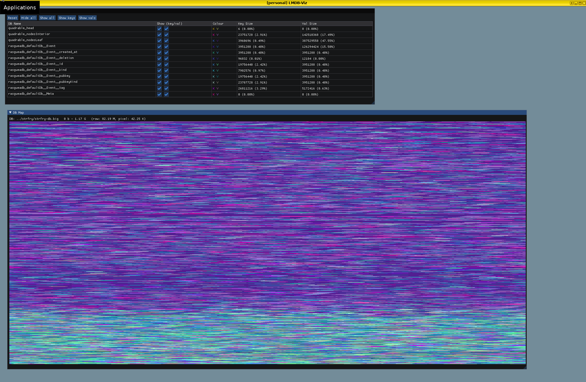
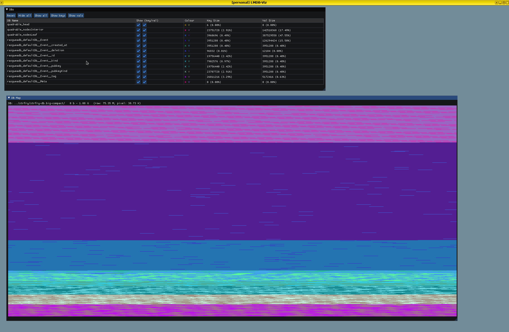

# alzapua

This is an interactive GUI tool for inspecting the low-level layout of [LMDB](https://lmdb.tech) data-base files.

## Compile

These are dependencies of golpe, some are not used but still need to be installed for now:

    sudo apt install -y git build-essential libyaml-perl libtemplate-perl libssl-dev zlib1g-dev liblmdb-dev libflatbuffers-dev

These are needed for the UI:

    sudo apt install -y libglfw3-dev libglew-dev

Setup and compile:

    git submodule update --init
    make setup-golpe
    make -j4

## Usage

Run `alzapua viz` with the path to your LMDB directory:

    ./alzapua viz path/to/my-db/

Two windows are opened (see screenshots below). The first lists the sub-databases along with some information such as how many bytes are occupied by each sub-database's keys and values.

The other window is a visualisation of the LMDB file's mappings. Each pixel corresponds to 1 or more bytes of the file, and is coloured according to what is stored there.

At some zoom levels, there may be multiple values stored (fully or partially) within 1 pixel's range. To disambiguate this, you can zoom in more, or unselect some of the DBs so they don't show up in the visualisation.

### Key-bindings

* `-` - zoom out
* `=` - zoom in
* `,` - reduce magnification
* `.` - increase magnification
* up arrow - move window of visible range up
* down arrow - move window of visible range down

"Zooming" means expanding or shrinking the window of the visible range. When the program is started, the default window shows the whole DB file.

"Magnification" means increasing the size of a "pixel" since a single monitor pixel can be hard to see properly. When the program is started, the magnification level is 8, which means an 8x8 pixel square represents a single "pixel" in the visualisation.

## Screenshots

Initial DB, 500k events and indices:

Same DB, after compaction:

